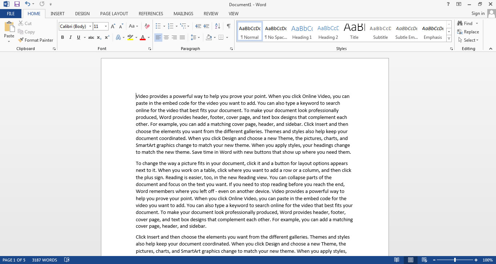

# Markdown (MD)

---

¿Cómo escriben textos en sus dispositivos electrónicos?
¿Qué les gusta o molesta de esta forma de trabajo?

---

# Lo que me parece interesante de MD

1. Es ligero
2. Sintaxis sencilla
3. Múltiples aplicaciones *(btw, esta presentación está escrita en md)*
4. Portable
5. Facilita la concentración al escribir
6. Muchos programas que permiten escribir en este formato

---

Dos paradigmas en los procesadores de texto

---

# WYSIWYG
(What You See Is What You **Get**)


---

**Vs**

---

# WYSIWYM
(What You See Is What Yoy **Mean**)


---

¿Conocen algún sistema de escritura así?

---
<style scoped>section{font-size:30px;}</style>
# Markdown

* Lenguaje de etiquetado ligero
* Creado en 2004 por [John Gruber](https://daringfireball.net/projects/markdown/)
* La sintaxis está diseñada para hacer los documentos legibles
* Se puede usar para muchas cosas: sitios web, documentos, notas, libros, presentaciones, mensajes de e-mail y documentación técnica
* Altamente portable: no hay una única aplicación que soporte estos archivos
* Multiplataforma
* Resiliente al paso del tiempo

---
<style scoped>section{font-size:30px;}</style>
# Algunos editores

* [Visual Studio Code](https://code.visualstudio.com)
* [Typora (Mac)](https://typora.io)
* [IA Writter (Mac / iOS)](https://ia.net/writer)
* [Dillinger (web)](https://dillinger.io)
* [Marktext (Mac/Windows/Linux)](https://github.com/marktext/marktext)
* [Entre muchas más](https://www.markdownguide.org/tools/)

---

**Cómo escribir en MD**
[Cheat Sheet](https://www.markdownguide.org/cheat-sheet/)

---

# Encabezados

```markdown
# Primer nivel
## Segundo nivel
### Tercer nivel
#### Cuarto nivel
##### Quinto nivel
###### Sexto nivel
```

---

# Listas numeradas

```markdown
1. Primer elemento
2. Segundo elemento
  1. Uno
  2. Otro
3. Tercer elemento
```

---

# Listas sin numerar

```markdown
* Primer elemento
* Segundo elemento
  * Uno
  *Otro
* Tercer elemento
```

---

# Énfasis

```markdown
Un texto con **negritas** e *itálicas*
```

---

# Enlaces

```markdown
[Markdown Guide](https://www.markdownguide.org/)
```

---

# Imágenes

```markdown


```

---

# Citas

```markdown
> Markdown is awesome!!
```

---

# Código (bloque)

```markdown
  <html>
    <head>
    </head>
  </html>
```

---

# Código (en línea)

```markdown
En una línea de texto puedo usar `esto para incluir código`
```

---

# Tablas

```markdown
| Syntax      | Description |
| ----------- | ----------- |
| Header      | Title       |
| Paragraph   | Text        |
```

---

# Tiempo de práctica

Selección de una solución de Voltaje y trasncripción a MD

---

**Exportar a otros formatos**

---
<style scoped>section{font-size:30px;}</style>

# Otras herramientas

* Presentaciones
  * [**Marp**](https://marp.app)
  * [**Remark**](https://remarkjs.com/)
* Generadores de sitios web estáticos
  * [Jekyll](https://jekyllrb.com)
  * [Hugo](https://gohugo.io/)
  * [Otros](https://jamstack.org/generators/)
* [**Obsidian**: similar a Notion](https://obsidian.md)

---

¿Preguntas?
