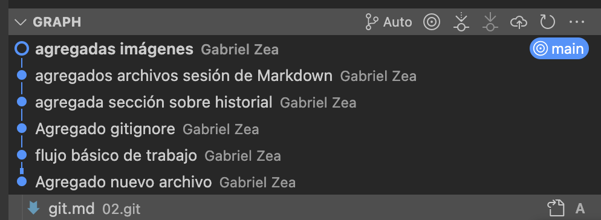
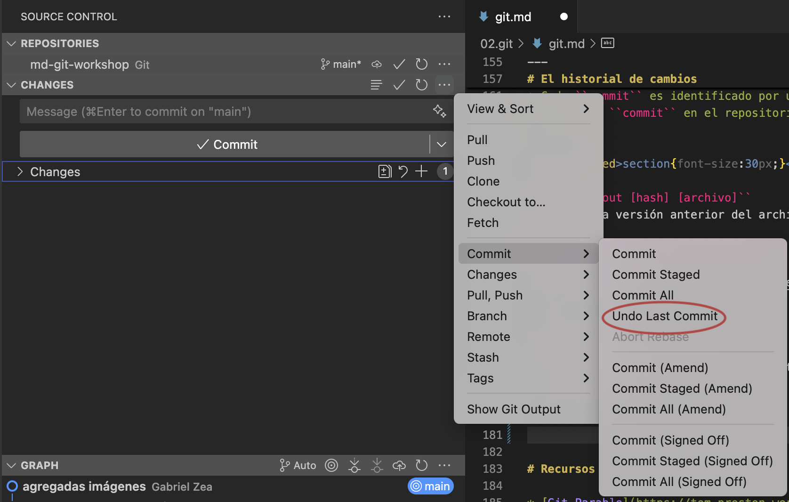

# Control de versiones con Git

---

# ¿Qué es control de versiones?

Sistema para guardar el historial y hacer seguimiento de cambios de edición en archivos digitales

``final-estesies-finalisimo-FINAL.doc``

---


---

* Es fácil de configurar
* Cada copia de un repositorio tiene todo el proyecto y su historial
  * `control+z` 
* Hay pocos comandos para usarlo cotidianamente
* Permite coordinar el trabajo de múltiples personas paralelamente
* Funciona de manera similar al historial de versiones de Google Docs

---

# Git Vs Github

* **Git**: software para el control de versiones
* **Github**: plataforma que hospeda repositorios de Git

---

# Herramientas 

* [Git](https://git-scm.com/downloads)
* [Visual Studio Code](https://code.visualstudio.com)
* [Clientes gráficos](https://git-scm.com/downloads/guis)

---

# Configuración inicial

```bash
git config --global user.name "Nombre"
git config --global user.email "correo@email.com"
git config --list
```

---

# Crear un repositorio
<style scoped>section{font-size:30px;}</style>

**Repositorio: directorio donde reside un conjunto de archivos que está bajo control de versiones**

1. Crear un directorio usando el explorador de archivos
2. ``git init``


---


el directorio ``.git`` contiene toda la información de nuestro nuevo repositorio

---


``git status``
Cómo está nuestro repo 

---

# El primer archivo

1. Crear un archivo de ``markdown`` con algún contenido
2. ``git status``

---

<style scoped>section{font-size:30px;}</style>

# Agregarlo al control de versiones


``git add``

---

# Staging area

Agrupación de cambios en uno o varios archivos listos para registrar los cambios en el historial

---

<style scoped>section{font-size:30px;}</style>


``git commit -m 'agregado nuevo archivo'``
Registrar los cambios en el repositorio

---

# Cambios

1. En el mismo archivo realizar algunos cambios y guardar el documento modificado

---

<style scoped>section{font-size:30px;}</style>


``git diff``
¿Qué ha cambiado en nuestro archivo?

---

# Flujo básico de trabajo en un repo

1. ``git status`` (cómo está mi repo)
2. Realizar cambios
3. ``git add`` (agregar cambios al *staging area*)
4. ``git commit`` (guardar los cambios de la actual versión)

---

<style scoped>section{font-size:30px;}</style>


``git log``
Ver el historial de cambios

---

# .gitignore

El archivo ``.gitignore`` permite no controlar versiones de directorios o documentos 


---

El contenido del archivo consiste en reglas por cada renglón que especifican a git que ignorar


---

# El historial de cambios

<style scoped>section{font-size:30px;}</style>

* Cada ``commit`` es identificado por un hash: ``7be606e``
* El último ``commit`` en el repositorio se llama ``HEAD``

---
<style scoped>section{font-size:30px;}</style>

``git checkout [hash] [archivo]``
Restaura una versión anterior del archivo especificado

``git checkout 7be606e mi-archivo.md``



---

``git checkout HEAD mi-archivo.md``
Regresa a la versión guardada en el último commit

---

Ups! ese último commit no está bien



``git revert [commit ID]``

---
# Ramas (branching)

* El repo tiene una carretera principal llamada ``main``
* Si queremos hacer un nuevo carril, no queremos afectar los ya existentes
* Para esto creamos encerramos el lugar de trabajo y cuando esté listo agregamos el nuevo carril a la carretera principal

---


---

# Recursos

* [Git Parable](https://tom.preston-werner.com/2009/05/19/the-git-parable.html)
* [Git-it: un curso para usar aprender a usar Git ](https://github.com/jlord/git-it-electron)