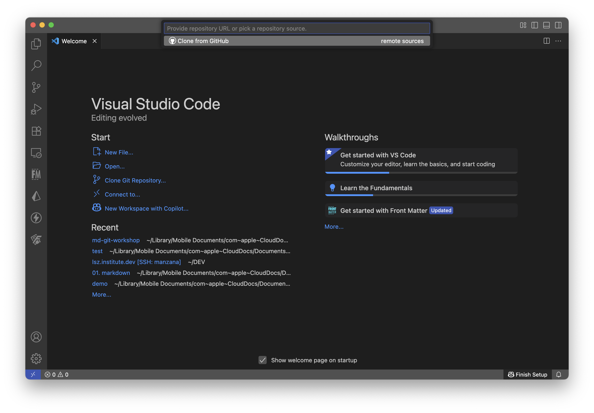

# Colaboración en Git

---

<style scoped>section{font-size:25px;}</style>

# Repaso

* ``git init``: Crea un repo
* ``git status``: Revisa el estado del repo
* ``git add``: Agrega cambios al ``staging area``
* ``git commit -m 'mensaje'``: Registra cambios en el historial
* ``git checkout [commit id] [archivo]``: Regresa el archivo a un estado anterior
* ``git branch [nombre]``: Crea una nueva rama
* ``git checkout [nombre]``: Cambiamos a la rama
* ``git merge [nombre]``: Une cambios de la rama especificada en la actual

---

# Git es un sistema distribuido

Permite tener múltiples copias sincronizadas

---

# Clonar un repo

Clonar (*clone*) un repositorio es tener hacer una copia idéntica en otro lugar

``git clone [repo-inicial] [ubicación-copia]``

---
<style scoped>section{font-size:25px;}</style>

Hacer una copia local



``git clone md-git-workshop nueva-copia``

---

# Remote

Define una conexión con un repo remoto

```
[remote "origin"]
        url = /Users/zea/iCloud/Documents/2025/md-git-workshop
        fetch = +refs/heads/*:refs/remotes/origin/*
[branch "main"]
        remote = origin
        merge = refs/heads/main
```
---

# Flujo de trabajo con repo remoto

1. ``git clone``: obtenemos la copia de trabajo
2. Hacemos cambios
3. ``git add`` + ``git commit``
4. ``git push``: *subimos* nuestros cambios al repositorio
5. ``git pull``: sincronizamos nuestra copia de trabajo
6. Repetimos 2-5